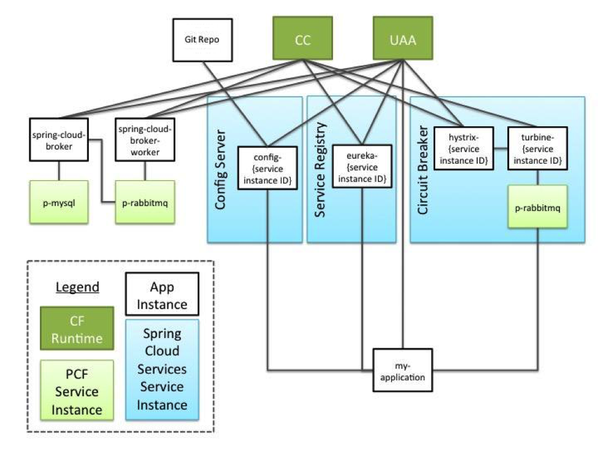

# playCloudFoundry

### [Overview](https://docs.cloudfoundry.org/concepts/architecture/)
    CC: The Cloud Foundry Cloud Controller.
    CC DB: The Cloud Controller database.
    CF: Cloud Foundry.
    CF Application: An application in Cloud Foundry; the application in cf push application.
    Dashboard SSO: Cloud Foundry’s Dashboard Single Sign-On.
    domain.com: The value configured by an administrator for the Cloud Foundry system domain.
    Eureka Application Name: The identifier used by a CF Application to look up other CF Applications that are registered with a Spring Cloud Services Service Registry service instance. A CF Application that registers with a Spring Cloud Services Service Registry service instance will use the value of its spring.application.name property for this value by default.
    FQDN: Fully Qualified Domain Name.
    Instance Record: In Eureka, the core domain object; represents a CF Application that has registered with a Spring Cloud Services Service Registry service instance. An Instance Record is used to map a Virtual Hostname to a physical route (e.g. hostname, IP address, and port). An Instance Record can have metadata associated with it.
    Operator: A user of Pivotal Cloud Foundry® Operations Manager.
    SB: The Spring Cloud Services Service Broker.
    SCS: Spring Cloud Services.
    UAA: The Cloud Foundry User Account and Authentication Server.
  
  